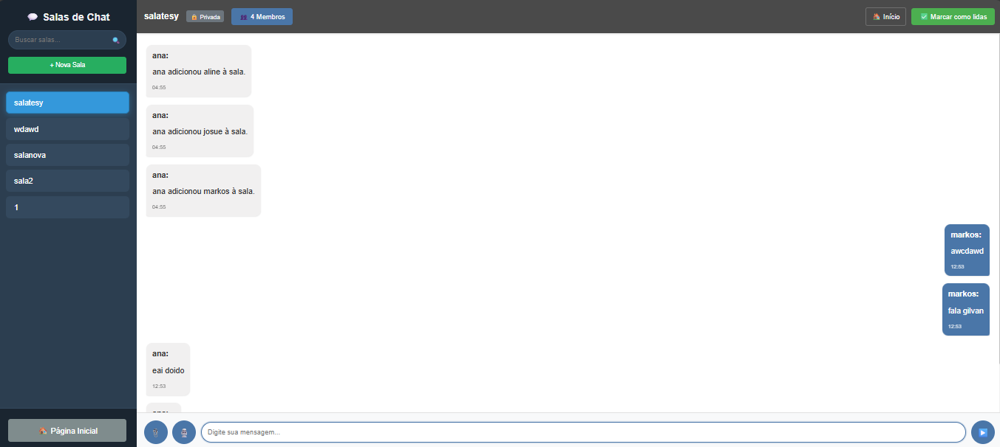
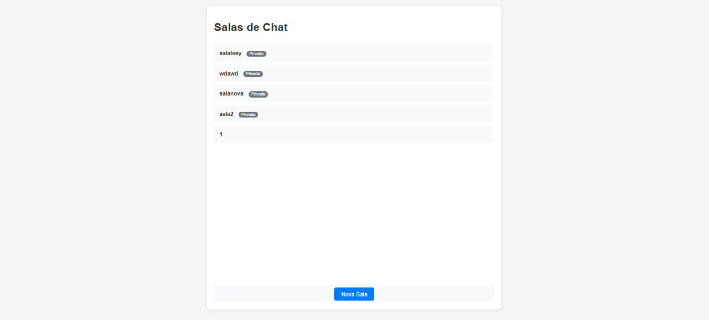
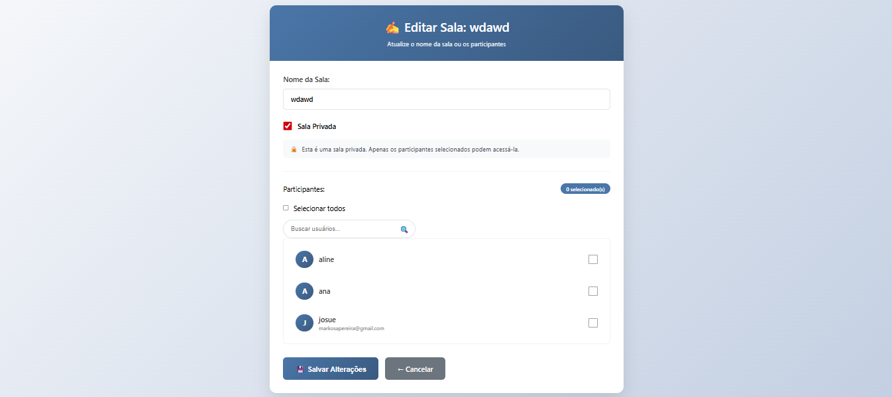

# 📡 Chat App em Tempo Real

Um aplicativo de chat em tempo real desenvolvido com **Django 5**, **Daphne**, **Django Channels** e **WebSockets**, com frontend em **JavaScript, HTML e CSS**.  
Permite comunicação instantânea entre usuários em diferentes salas, com suporte a anexos e notificações em tempo real.

---

## 🚀 Funcionalidades

- 🔑 Autenticação de usuários  
- 🏠 Criar, entrar e sair de **salas de chat**  
- 👥 Adicionar pessoas às salas  
- 🔔 **Notificações em tempo real** (entrada/saída de usuários, novas mensagens)  
- 📎 Envio de **anexos** (imagens/documentos)  
- ❌ Excluir suas próprias salas  
- ♻️ Atualização automática da lista de conversas em tempo real  

---

## 🛠️ Tecnologias Utilizadas

- **Back-end:**  
  - Python 3.11+  
  - Django 5  
  - Django REST Framework  
  - Django Channels  
  - Daphne (servidor ASGI)  

- **Front-end:**  
  - JavaScript (WebSocket API nativa)  
  - HTML5  
  - CSS3  

- **Outros:**  
  - SQLite (dev) ou PostgreSQL (produção recomendado)  
  - Twisted + Autobahn (dependências de WebSockets/ASGI)  

---
## Video

<video src="demonstracao.mp4" controls width="700"></video>

## Prints
<p align="center">
  
</p>

<p align="center">
  
</p>

<p align="center">
  
</p>

## ⚙️ Instalação e Configuração

1. **Clone o repositório**
   ```bash
   git clone https://github.com/seu-usuario/chat-app.git
   cd chat-app
